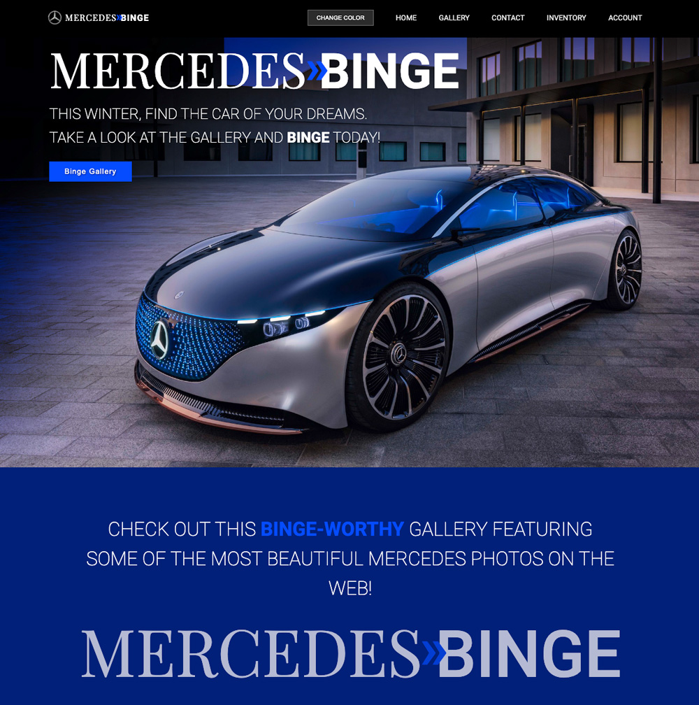

# Mercedes Binge
## A Binge-worthy Mercedes Benz Gallery App!

## Purpose:

Welcome to the Mercedes Binge gallery app where users can view binge-worthy photographs of beautiful Mercedes Benz automobiles. This app has a special `CHANGE COLOR` button in the navigation bar that will change the websites color theme including the main landing page photo! The links in the navbar also include links to the Mercedes Benz official site in case you get the urge to buy one of these beauties for yourself. Enjoy the site!

 

## Deployed Website Link:
## https://dronetdevdesign.github.io/mercedes-binge-app/

 

## **Table of contents:**
- [Usage](#usage)
- [Contribute](#contribute)
- [Questions](#questions)

 

     

 

## Viewable Responsive Screen Sizes:

* Desktop: 2000px
* Media Query Sizes:
  - 1200px to 992px (Desktop - laptops)
  - 768px (Laptop - tablets)
  - 576px (Small devices)
  - 430px (large cell phones)
  - 390px (small cell phones)

 

## This App Was Created Using:
  - JavaScript
  - UnSplash API
  - HTML 
  - CSS
  - FontAwesome
  - Boxicons
  - Git/GitHub

 

## Graphic Software Used:
  - Adobe Photoshop
  - Adobe Illustrator
  - Sketch

 

## Usage:

### The respository can be cloned and placed in a folder remotely.

 

## Contribute:

### Please contact me regarding contributing to this repository. All additions must be approved.

 

## Questions?

### If you have any questions here's how to contact me:

- Username: DronetDevDesign
- Repository: https://github.com/DronetDevDesign/mercedes-binge-app
- Email: ron@DronetDevDesign.com

